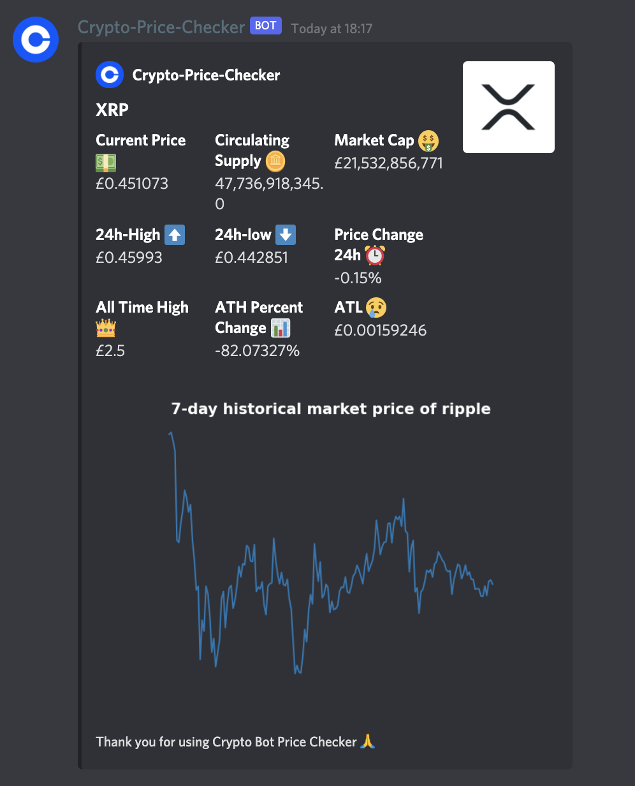
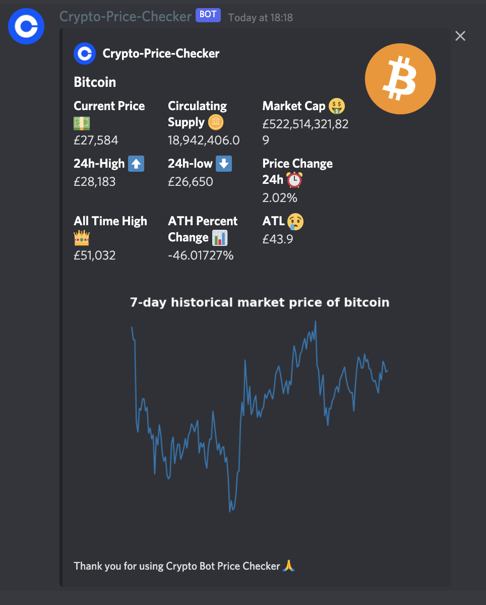

## Crypto Dicord Bot
A bot that returns back the price of a limited set of cryptocurrency prices.

## Installation
Before running the code make sure to install the packages listed below

### Discord.py

```python 
pip3 install discord.py
```
### CoinGeko API Wrapper

```python
pip3 install pycoingecko
```

## Commands
- `$help`:- Informes the user which coins/tokens are supported and how to call their prices
- `$about`:- Where to find the source code and who the creater is
- `$trending`:- Provides the top 7 trending search coins/tokens 
- `$market_dominance`:- Returns a list of the most dominant coins in terms of overall market cap percentage
- `$news`:- Returns top 5 articles related to cryptocurrencies in to your DM (requires improvement❗️)


## Demo
XRP |  Bitcoin
:-------------------------:|:-------------------------:
||
